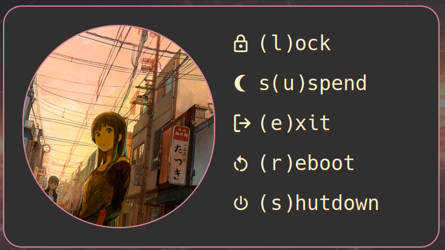
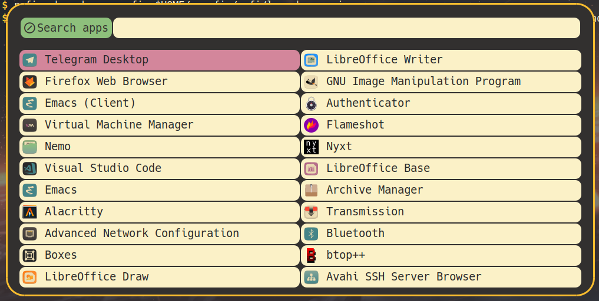
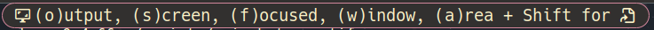
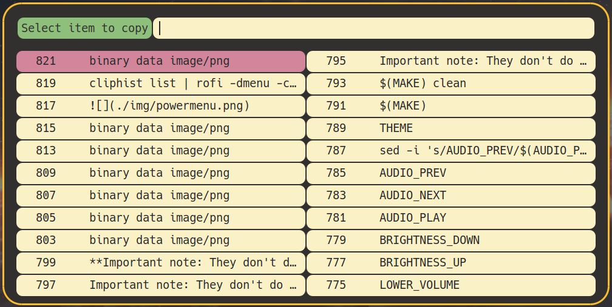

## Rofi widgets

This repo contains several rofi config files for powermenu, launcher and screenshots and clipboard.

**Important note: They don't do anything when using standalone except fancy help on keyboard shortcuts**

### Powermenu

### Launcher

### Screenshots

### Clipboard

## What's next

This repo is a part of my config that consists of sway, waybar and rofi + my favourite wallpapers. So please make sure to check my other repos:

1. [sway-setup](https://github.com/VasKho/sway-setup)
1. [waybar-config](https://github.com/VasKho/waybar-config)
